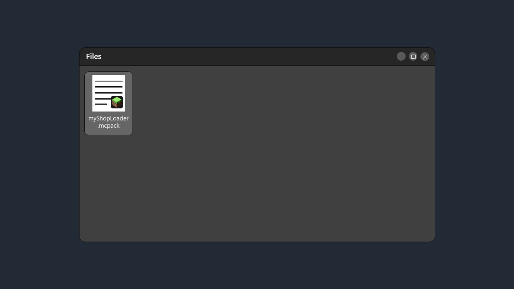
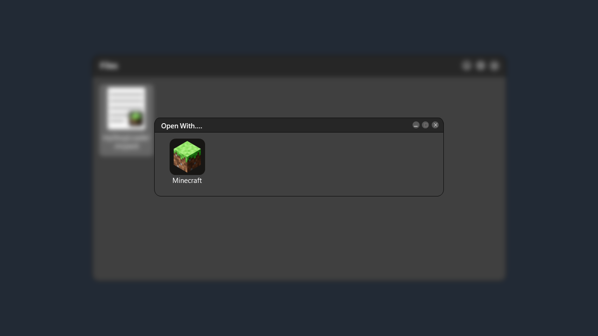
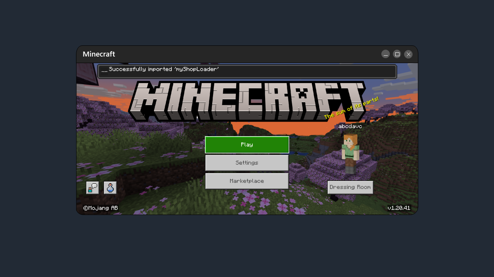
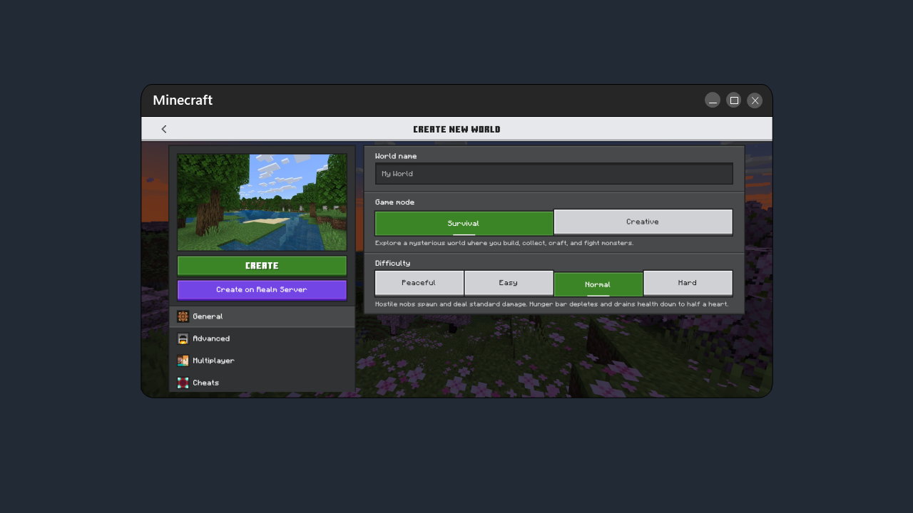
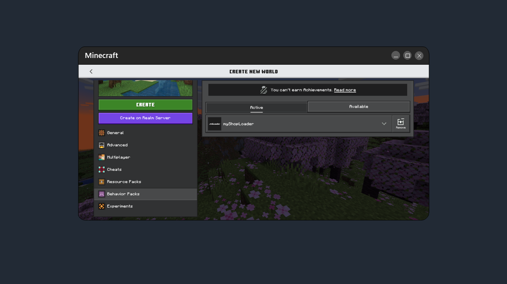
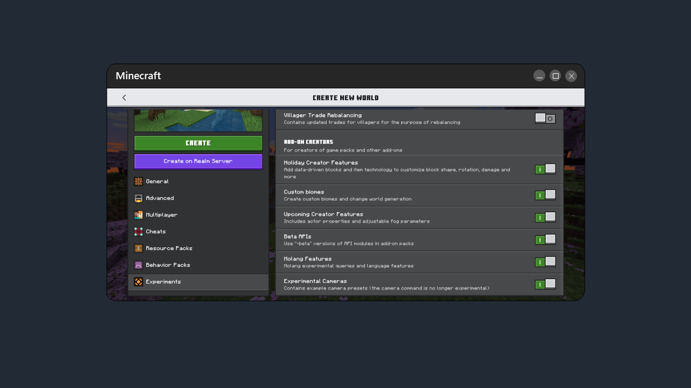

# 🚀 Install Minecraft Bedrock Mods

There are several ways to install Minecraft Bedrock Mods, I would recommend using the `.mcpack` or `.mcaddon` format, because this way the mod will be immediately installed in your Minecraft with just one click.

## Quick Installation steps

### 1. Open your File Manager.

### 2. Double click and open with Minecraft.

### 3. Wait a seconds until the mods already installed.

### 4. Create a new world.

### 5. Active the behavior packs and/or resource pack.

### 6. Enable experimental features.

### 7. Finish! 🏁
